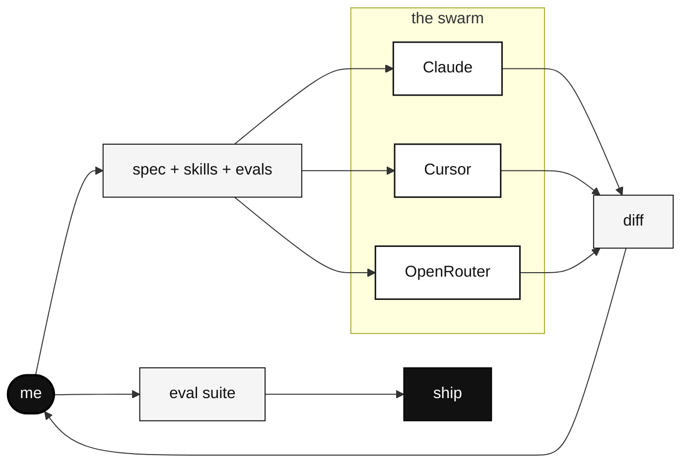

<header align="center">

## Hi! I'm Abhishek P, alias [abhiigatty](https://abhiigatty.com). Human in Tech. 👋


</header>

I'm a senior backend engineer who loves products, infrastructure, and solving puzzles. These days most of my day goes into writing specs, skills, and evals, and managing a swarm of agents. Some are Claude. Some live in Cursor. Some live on OpenRouter. They do the typing. I do the thinking.

I sit in the loop. I have opinions about taste. I trust evals more than vibes.

<section>

## What I'm Doing Right Now

* Working at **[@asymmetric-labs-ai](https://github.com/asymmetric-labs-ai)**.
* Building side projects with friends and builders that solve problems, provide value, and bring in revenue.
* Part of the **[Sahyadri Open Source Community (so-sc)](https://github.com/so-sc)**.
* Living in Bangalore, India. UTC +05:30.

</section>

<section>

## Current Workflow



I write the spec. The agents draft the diff. I read it, run the eval suite, and decide if it ships. The agents are fast. The eval is what makes me trust the diff. The taste is what decides if it ships at all.

Most of my hours go into writing specs and skills, reading agent diffs, and running evals. A small slice still goes into product thinking and the occasional bit of code by hand.

</section>

<section>

## Current Learning In The AI Development Age

* **Evals are the new tests.** Unit tests check that a function does what you wrote. Evals check that the system does what you *meant*. If you can't measure it, you can't trust it, and you definitely can't ship it.
* **Backend reflexes still earn their keep.** Knowing how a queue, a cache, or a slow query actually behaves is the fastest way to spot when a model is confidently wrong.
* **Taste is the bottleneck.** Anyone can generate a thousand lines of code now. Far fewer people can tell you which fifty lines are worth keeping. That's the job.
* **Specs beat prompts.** A good spec survives a model swap. A clever prompt usually doesn't.

</section>

<section>

## Current Toolkit And Experience With Technologies

<details>
<summary><b>Agents and AI</b></summary>

Claude · Claude Code · Cursor · OpenRouter · OpenAI

</details>

<details>
<summary><b>Languages and Frameworks</b></summary>

Python · Go · Django · Flask · FastAPI · Gin · AsyncIO

</details>

<details>
<summary><b>Databases and Caching</b></summary>

PostgreSQL · MySQL · SQLite · Redis · AWS DynamoDB · PgBouncer

</details>

<details>
<summary><b>Queues, Async, and Realtime</b></summary>

RabbitMQ · Celery · NGINX · uWSGI · Gunicorn · WebRTC · MQTT

</details>

<details>
<summary><b>Cloud and Infra</b></summary>

AWS (EC2, Lambda, S3, IoT Core, Kinesis, SNS, SES, SQS) · DigitalOcean · Docker · Kubernetes · Jenkins · ArgoCD · Rancher · Cloudflare · Prometheus · Kibana · Elasticsearch

</details>

<details>
<summary><b>Auth, Comms, and SaaS I've Shipped Against</b></summary>

Keycloak · OAuth 2.0 · OpenID · Twilio · SendGrid · Mailgun · Braze · Zendesk · Swagger · Postman

</details>

<details>
<summary><b>Version Control and Shell</b></summary>

Git · GitHub · GitLab · Linux · Bash · Vim · VS Code

</details>

### Where I've Worked

| company | role | the gist |
|---|---|---|
| **InstaViewAI** | Sr. Backend Engineer | AI interview infra, the part where the model meets the user |
| **UniCourt** | SDE | Big data, search, court records, PACER, law-as-a-service |
| **Velotio** | SDE | Consulting across backend, mobile, hardware, and cloud |
| **Kami Vision** | SDE | Computer vision adjacent backend, IoT, video pipelines |

The thread through all of it. Data heavy backends, distributed systems, and a healthy paranoia about correctness. Domain-driven design, SOC 2, OEM portals, subscription systems, and a lot of glue between hardware, cloud, and the user.

</section>

<section>

## Things I Care About

| | | |
|---|---|---|
| **Open source** | **Big data and distributed systems** | **InfoSec and pentesting** |
| The license isn't the part that matters. The people who show up are. | My old habitat. Still the lens I reach for first. | Paranoid by default. It's a feature. |

**AI product craft.** The interesting gap right now is between "the demo works" and "users trust it every day." Most of that gap is evals, taste, and a lot of patient iteration.

</section>

<section>

## How I Actually Pick Models

Picking a model based on a 5 prompt spot check feels good and tells you almost nothing. A workflow I actually run.

```bash
# 1. write 30 to 50 real inputs from production logs
# 2. write a grader, LLM as judge or rule based
# 3. run the candidate change against the eval suite
# 4. compare pass rate, p50 and p95 latency, cost per run
# 5. only then decide
```

It's slower than vibing. It also stops me shipping regressions I'd otherwise miss until a user finds them.

The tradeoff: writing the eval set is the most annoying part of the job. I keep doing it because every time I skip it, I regret it within a week.

</section>

<section>

## GitHub, In Numbers

<div align="center">


<br/>
<br/>


</div>

</section>

<footer align="center">

---

[abhiigatty.com](https://www.abhiigatty.com) · [𝕏](https://twitter.com/abhiigatty_) · [GitHub](https://github.com/AbhiiGatty) · [LinkedIn](https://www.linkedin.com/in/abhiigatty) · [Instagram](https://www.instagram.com/abhiigatty) · [Email](mailto:abhiigatty@gmail.com)

</footer>
