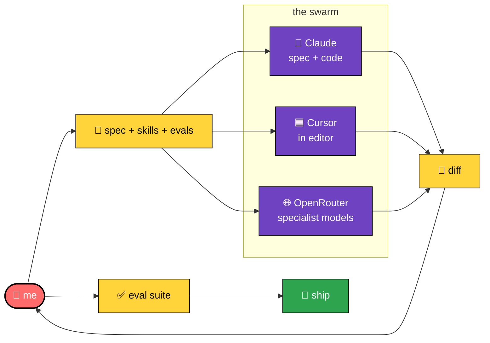
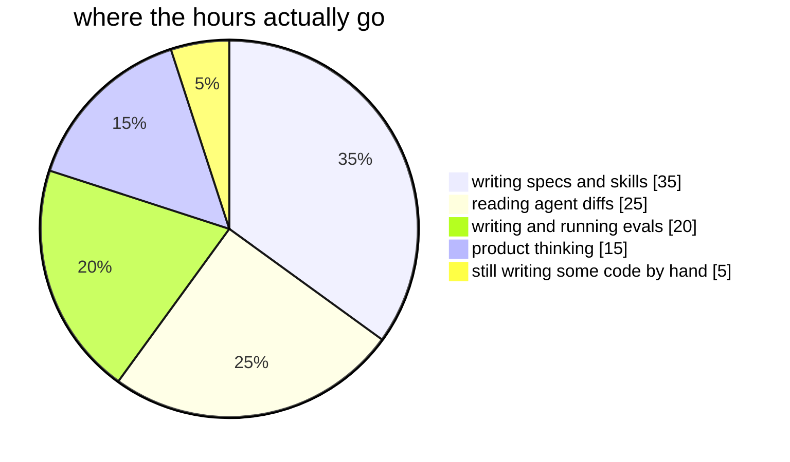

<div align="center">

[](https://www.abhiigatty.com)
[](https://twitter.com/abhiigatty_)
[](https://www.linkedin.com/in/abhiigatty)
[](mailto:abhiigatty@gmail.com)


</div>

## hi, I'm Abhishek 👋

I'm a senior backend engineer who loves products, infrastructure, and solving puzzles. These days most of my day goes into writing specs, skills, and evals, and managing a swarm of agents. Some are Claude. Some live in Cursor. Some live on OpenRouter. They do the typing. I do the thinking.

I sit in the loop. I have opinions about taste. I trust evals more than vibes.

## what I'm doing right now

[](https://github.com/asymmetric-labs-ai)
[](https://github.com/so-sc)
[](mailto:abhiigatty@gmail.com)

* Working at **[@asymmetric-labs-ai](https://github.com/asymmetric-labs-ai)**.
* Part of the **[Sahyadri Open Source Community (so-sc)](https://github.com/so-sc)**.
* Living in Bangalore, India. UTC +05:30.

## the swarm I work with



The agents are fast. The eval is what makes me trust the diff. The taste is what decides if it ships at all.

A few things I've learned from doing it this way for a while.

* 🧪 **Evals are the new tests.** Unit tests check that a function does what you wrote. Evals check that the system does what you *meant*. If you can't measure it, you can't trust it, and you definitely can't ship it.
* 🛠️ **Backend reflexes still earn their keep.** Knowing how a queue, a cache, or a slow query actually behaves is the fastest way to spot when a model is confidently wrong.
* 🎯 **Taste is the bottleneck.** Anyone can generate a thousand lines of code now. Far fewer people can tell you which fifty lines are worth keeping. That's the job.
* 📐 **Specs beat prompts.** A good spec survives a model swap. A clever prompt usually doesn't.

## the toolkit I actually pull from

**agents and AI**

[](https://www.anthropic.com)
[](https://www.anthropic.com)
[](https://cursor.com)
[](https://openrouter.ai)
[](https://openai.com)

**backend**


**data**


**infra**


## where I split my time these days



## what I worked on before this

| company | role | the gist |
|---|---|---|
|  | Sr. Backend Engineer | AI interview infra, the part where the model meets the user |
|  | SDE | Big data, search, a lot of legal data |
|  | SDE | Consulting across a bunch of domains |
|  | SDE | Computer vision adjacent backend work |

The thread through all of it. Data heavy backends, distributed systems, and a healthy paranoia about correctness.

## things I care about

| | | |
|---|---|---|
| 🌱 **Open source** | 🗄️ **Big data and distributed systems** | 🔐 **InfoSec** |
| The license isn't the part that matters. The people who show up are. | My old habitat. Still the lens I reach for first. | Paranoid by default. It's a feature. |

🤖 **AI product craft.** The interesting gap right now is between "the demo works" and "users trust it every day." Most of that gap is evals, taste, and a lot of patient iteration.

## a small example of what I mean by "evals over vibes"

Picking a model based on a 5 prompt spot check feels good and tells you almost nothing. A workflow I actually run.

```bash
# 1. write 30 to 50 real inputs from production logs
# 2. write a grader, LLM as judge or rule based
# 3. run the candidate change against the eval suite
# 4. compare pass rate, p50 and p95 latency, cost per run
# 5. only then decide
```

A made-up but representative comparison from a recent model swap.

```mermaid
xychart-beta
    title "candidate vs incumbent on the same eval set"
    x-axis ["pass rate %", "p50 ms", "p95 ms", "cost / 1k runs $"]
    y-axis "value (lower is better, except pass rate)" 0 --> 100
    bar [62, 38, 71, 44]
    bar [78, 22, 49, 28]
```



It's slower than vibing. It also stops me shipping regressions I'd otherwise miss until a user finds them.

The tradeoff. Writing the eval set is the most annoying part of the job. I keep doing it because every time I skip it, I regret it within a week.

## github, in numbers

<div align="center">


</div>

## where to find me

[](https://www.abhiigatty.com)
[](https://twitter.com/abhiigatty_)
[](https://www.linkedin.com/in/abhiigatty)
[](mailto:abhiigatty@gmail.com)
[](https://github.com/AbhiiGatty)

If you want to talk about AI workflows, evals, product taste, or open source, pick any of the above. I'm easy to reach.
